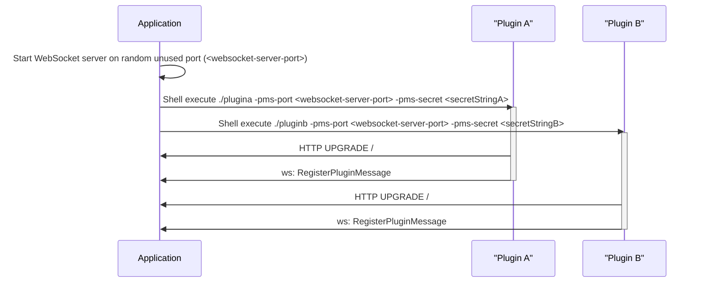
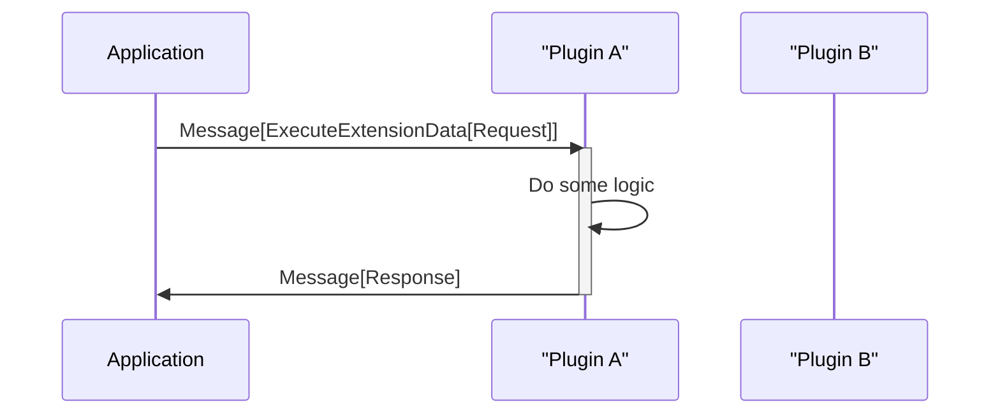
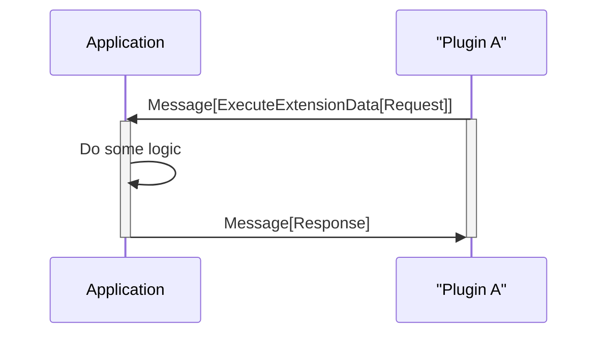
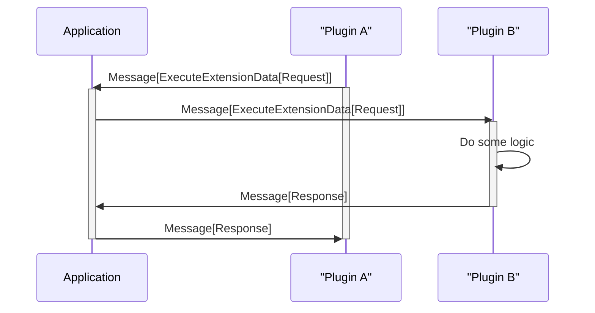
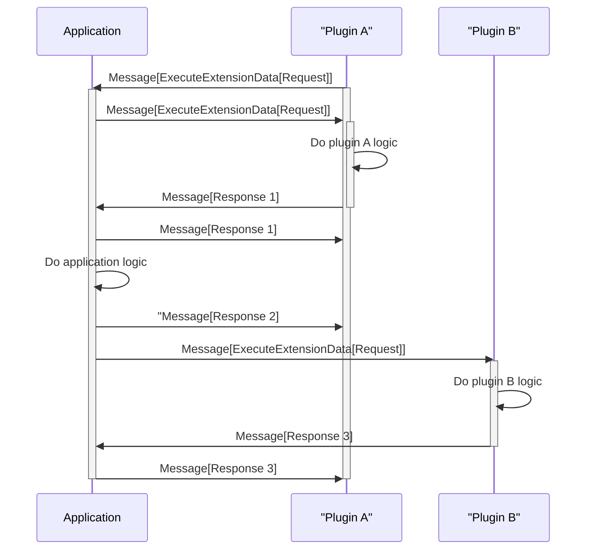

# Go plugins protocol

## Description
During initialization, the host application starts a WebSocket server using a random unused port on localhost.
Then application executes all plugins' binaries with two command line parameters:
- `-pms-port` has the value of the port
- `-pms-secret` has the generated random string which should be used by plugin during its registration

Host Websocket server and plugins uses text messages with JSON to communicate.

Message types used for communication are declared in [plugins-lib: Message](./plugins-lib/pkg/plugins/types/message.go)

During registration, plugins connects to host server. Then send to host server secret received via CLI parameter with all information about its extensions,
so the host could invoke them when required. For details, see RegisterPluginMessage in [plugins-lib](./plugins-lib/pkg/plugins/types/message.go)

When some code want to execute Extensions for ExtensionPoint it sends request message with `"type": "executeExtension"`. Host server executes each extension for the specified extension point (in resolved order) and returns results as a responses to this request.

## Sequence diagrams 

### Initialization


Example of the message sent by plugin (from the [examplecli](./examplecli)):
```json
{
  "command": "registerPlugin",
  "data": {
    "pluginID": "plugin.A",
    "secret": "Mp87uPLgkfQpYoJ2cuasAqyU3HUKQZdBTXvrWzAU3DoDDcB4rNj92cauQO75k536",
    "extensions": [
      {
        "ID": "plugina.hello",
        "ExtensionPointID": "hello"
      },
      {
        "ID": "plugina.hello.welcome",
        "ExtensionPointID": "hello",
        "AfterExtensionIDs": [
          "plugina.hello"
        ]
      },
      {
        "ID": "plugina.hello.currentDate",
        "ExtensionPointID": "hello",
        "BeforeExtensionIDs": [
          "plugina.hello.welcome"
        ],
        "AfterExtensionIDs": [
          "plugina.hello",
          "plugina.init"
        ]
      },
      {
        "ID": "plugina.getRandomNumber.default",
        "ExtensionPointID": "plugina.getRandomNumber"
      }
    ]
  },
  "isFinal": true
}
```

### Execute extension point from Application implemented in Plugin A


Example of the message sent by the app to the plugin (from the [examplecli](./examplecli)):
```json
{
  "command": "executeExtension",
  "msgID": "5fea8d50-6fa6-4ed2-8317-2eea48c0ad61",
  "data": {
    "extensionPointID": "hello",
    "extensionID": "plugina.hello",
    "data": "Anton"
  },
  "isFinal": true
}
```

Example of the message sent by the plugin to the app (from the [examplecli](./examplecli)):
```json
{
  "command": "executeExtension",
  "correlationID": "5fea8d50-6fa6-4ed2-8317-2eea48c0ad61",
  "data": {
    "message": "Hello Anton from plugin A!"
  },
  "isFinal": true
}
```

### Execute extension point from Plugin which has extension in Application


### Execute extension point from Plugin A which has extension in Plugin B


### Execute extension point from Plugin A which has extensions in both Plugins and in Application in order pluginA->app->plugin B
